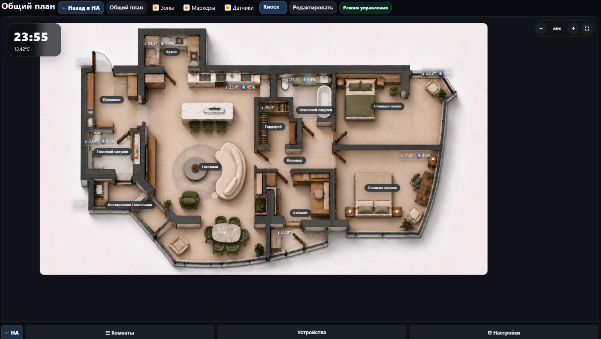
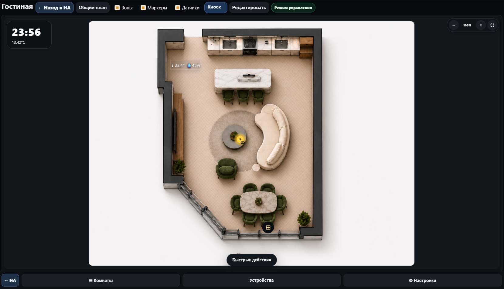
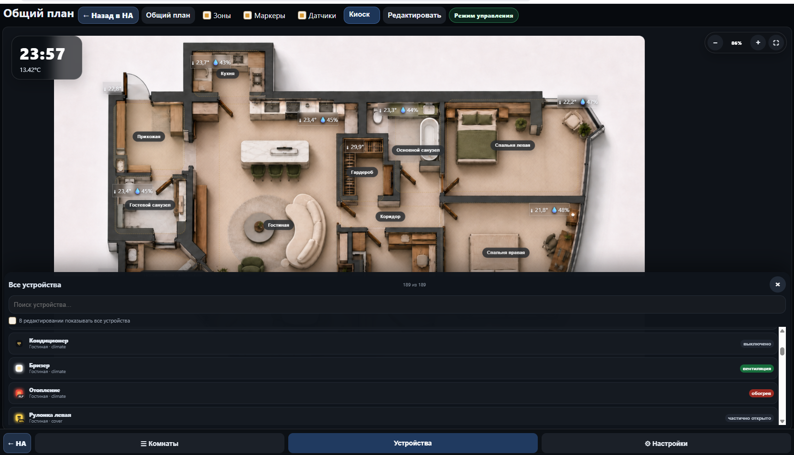
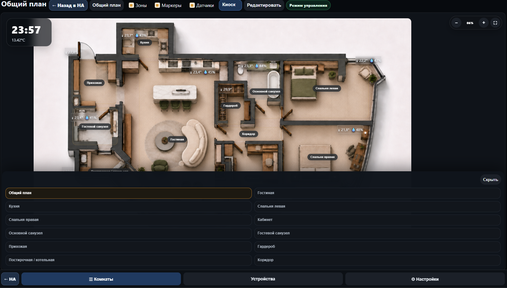
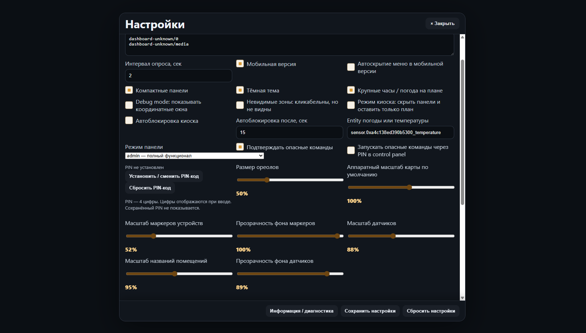

# ALLHA-3D

**ALLHA-3D** — локальная 3D/floor-plan панель для Home Assistant в виде add-on.

Проект показывает квартиру или дом как интерактивный план: комнаты, зоны, устройства, датчики, состояния, kiosk mode, режим управления и отдельный редактор координат. Интерфейс рассчитан на настенную панель, планшет, мобильный экран и ПК.

> Репозиторий проекта: https://github.com/Lepi4/smart-home-ui  
> Разработчик: **Lepi4**  
> Приложение: **ALLHA-3D**  
> Версия: **3.5.5.3**

---

### v3.5.5.3: factory reset + compact standard sensors

После добавления очистки layout добавлены обратные действия:

- `Настройки → Layout / Обслуживание → Создать / восстановить зону`;
- выбор найденной комнаты и открытие SVG Zone Editor;
- `Открыть размещение устройств` для маркеров после очистки;
- функции доступны только в admin mode;
- после применения в редакторе нужно нажать `Сохранить изменения`.

### v3.5.5: clear markers / clear zones

Добавлен раздел **Настройки → Layout / Обслуживание**. В admin mode доступны две отдельные сервисные операции:

```text
Очистить маркеры
Очистить зоны
```

**Очистить маркеры** удаляет размещение устройств и датчиков на общем плане и в комнатах. Список устройств, Lovelace import, комнаты, зоны, картинки, security/PIN, dangerous и Attention Monitor не затрагиваются. После очистки устройства считаются неразмещёнными и могут быть заново расставлены через SVG Layout Editor.

**Очистить зоны** удаляет только прямоугольные зоны комнат на overview. Маркеры, устройства, комнаты, картинки и настройки безопасности не затрагиваются.

Перед каждой очисткой создаётся backup текущего `layout.json` в `/data/backups/`:

```text
layout-before-clear-markers-YYYY-MM-DD...json
layout-before-clear-zones-YYYY-MM-DD...json
```

API v3.5.5:

```text
POST /api/layout/clear-markers
POST /api/layout/clear-zones
```

---

### v3.5.4.1: hotfix картинок комнат и neutral fallback

Исправлены повторная загрузка той же картинки комнаты, сброс комнаты к fallback и обновление открытой комнаты после замены. Fallback теперь означает нейтральную пустую SVG-заглушку, а не демо-картинку квартиры из Docker image. Пользовательские картинки по-прежнему хранятся только в `/data/images`.

### v3.5.4: картинки найденных комнат + reset room image

В настройках расширен раздел **Картинки / План**: кроме общего плана теперь есть список найденных комнат. Для каждой комнаты можно загрузить, заменить или сбросить пользовательскую картинку к fallback без ручной замены файлов внутри Docker.

Комнаты не создаются вручную. Список берётся из текущей конфигурации/найденных комнат, а картинки сохраняются отдельно для каждого `room_id`.

```text
/data/images/rooms/<room_id>.webp
/data/images/originals/rooms/<room_id>-original.<ext>
/data/images/images_meta.json
/data/backups/
```

Перед заменой или сбросом картинки комнаты создаётся backup текущей картинки, `images_meta.json` и `layout.json`. Если новая картинка имеет другое соотношение сторон, маркеры комнаты могут визуально сместиться, но координаты layout не удаляются.

API v3.5.4:

```text
GET    /api/images
POST   /api/images/rooms/:room_id
DELETE /api/images/rooms/:room_id
```

Обработка изображений использует pipeline v3.5.3: PNG/JPG/WEBP до 25 MB, проверка MIME/расширения/сигнатуры, ограничение размера изображения и WebP рабочая версия через `sharp` при наличии конвертера.

---

### v3.5.3: image converter pipeline

Загрузка изображений стала безопаснее: сервер проверяет MIME type, расширение, сигнатуру файла, размер файла и размер изображения в пикселях. Оригинал сохраняется в `/data/images/originals/`, а рабочая версия оптимизируется в WebP через `sharp` с сохранением aspect ratio и ограничением длинной стороны.

```text
overview: максимум 3000 px по длинной стороне
room: максимум 2500 px по длинной стороне
upload: максимум 25 MB на один файл
pixels: максимум около 55 MP
```

Если WebP-конвертер недоступен, сервер не падает и сохраняет рабочую копию в исходном формате как `copy fallback`. Состояние converter pipeline отображается в **Информация / диагностика → Система → Images storage**.

---

### v3.5.2: загрузка и сброс общего плана

В настройках появился раздел **Картинки / План → Общий план**. Через него можно загрузить или заменить картинку общего плана без ручной замены файлов внутри Docker. Также добавлена кнопка **Сбросить к fallback**, которая убирает пользовательский файл и показывает нейтральную пустую заглушку до новой загрузки.

Перед заменой или сбросом создаётся backup текущей картинки, `images_meta.json` и `layout.json`. Пользовательские картинки хранятся только в `/data/images`, а Docker image не используется как источник пользовательских или demo-планов.

```text
/data/images/overview/
/data/images/originals/
/data/images/images_meta.json
/data/backups/
```

Поддерживаются PNG, JPG/JPEG и WEBP до 25 MB на один файл. Общий план отдаётся через `/media/images/overview.webp`; если custom-картинки нет, используется нейтральная SVG-заглушка. API: `GET /api/images`, `POST /api/images/overview`, `DELETE /api/images/overview`.

## Что умеет ALLHA-3D

### Интерактивный общий план

- общий 3D-план квартиры/дома;
- переход в комнаты по зонам;
- видимые или невидимые кликабельные зоны;
- подписи комнат;
- устройства и датчики поверх зон;
- отдельные изображения комнат;
- масштабирование карты;
- крупные часы и температура/погода на плане.



---

### Устройства и состояния

На карте можно размещать устройства Home Assistant:

- свет;
- выключатели;
- шторы;
- климат;
- медиа;
- кнопки;
- датчики;
- binary sensors;
- другие entity из Home Assistant.

Состояния отображаются человекочитаемо:

```text
on/off → включено/выключено
open/closed → открыто/закрыто
detected/clear → обнаружено/не обнаружено
unavailable → недоступно
unknown → неизвестно
```



---

### Панель устройств

Панель устройств помогает быстро найти entity:

- поиск по имени;
- список всех устройств;
- состояние справа;
- группировка и фильтрация;
- отображение только размещённых или всех устройств в режиме редактирования.



---

### Панель комнат

Панель комнат открывает найденные комнаты и общий план.

Комнаты не создаются вручную внутри ALLHA-3D. Они берутся из:

1. Lovelace card / section title;
2. имени устройства или `entity_id`;
3. Home Assistant Area;
4. “Неразмещённые”, если комнату определить нельзя.



---

## SVG Layout Editor

ALLHA-3D не использует drag-and-drop для размещения.  
Редактирование координат сделано через отдельный **SVG Layout Editor**.

Сценарий размещения:

```text
Редактировать
→ выбрать устройство
→ SVG Layout Editor
→ клик/тап по сетке
→ X/Y или стрелки для точной подстройки
→ Применить
```

Сценарий перемещения:

```text
Редактировать
→ короткий тап по объекту = выбрать
→ долгое удержание = открыть SVG Layout Editor
→ клик/тап по новой точке
→ Применить
```

Почему так:

- координаты стабильны на ПК и мобильном;
- zoom/pan не влияют на layout;
- layout хранит проценты 0–100;
- нет проблем с drag/drop на touch-экранах;
- проще точно размещать устройства.

---

## Зоны

Зоны используются для перехода из общего плана в комнаты.

Возможности:

- прямоугольные зоны;
- отдельное изменение X/Y/W/H;
- поворот прямоугольника;
- видимые зоны;
- невидимые зоны;
- зоны остаются кликабельными, даже если визуально скрыты;
- в edit mode зоны всегда видны как контуры.

Логика настройки:

```text
Зоны выключены
→ зоны не видны и не кликабельны

Зоны включены + Невидимые зоны выключены
→ зоны видны и кликабельны

Зоны включены + Невидимые зоны включены
→ зоны не видны, но кликабельны
```

---

## Kiosk mode

Kiosk mode предназначен для настенных панелей и планшетов.

Возможности:

- скрытие лишних панелей;
- полноэкранный режим;
- список комнат поверх карты;
- lock/unlock;
- autolock;
- компактный тревожный индикатор “!” при active alert;
- режим управления с подтверждениями опасных действий.

---

## “Внимание” / Attention Monitor

Можно добавить устройство в мониторинг состояния.

Как работает:

1. В admin mode удержать устройство.
2. В существующем меню включить “Следить за изменением состояния”.
3. Текущее состояние сохраняется как нормальное.
4. Если entity ушло из этого состояния — в kiosk появляется кнопка “!”.
5. Если entity вернулось в норму — alert исчезает автоматически.

Важно:

- alert глобальный;
- не зависит от текущей комнаты;
- visible marker на текущем экране не обязателен;
- viewer/control panel могут смотреть окно;
- добавление/удаление правил доступно только admin.

---

## Режимы доступа

ALLHA-3D использует 3 режима:

| Режим | Возможности |
|---|---|
| **viewer** | только просмотр |
| **control panel** | просмотр и управление устройствами |
| **admin** | полный функционал, настройки, редактор, security |

Кнопка **“Редактировать”** показывается только в `admin`.

---

## PIN и dangerous-команды

Опасные действия можно защищать подтверждением или PIN.

Dangerous-действия:

- замки;
- клапаны;
- кнопки действия;
- скрипты;
- automation trigger;
- любые устройства, вручную помеченные как dangerous.

В `control panel` dangerous-действия требуют подтверждение, а при включённой настройке — PIN.

В `admin` PIN для dangerous-действий не требуется.

PIN:

- 4 цифры;
- хранится не plain text;
- можно установить, сменить или сбросить;
- сохранённый PIN не отображается.

Для владельца предусмотрен резервный механизм восстановления PIN. Не публикуйте значение резервного кода в публичных материалах, если репозиторий открыт.

---

## Настройки



В настройках доступны:

- режим панели;
- mobile mode;
- compact panels;
- theme;
- debug mode;
- kiosk mode;
- autolock;
- зоны / невидимые зоны;
- маркеры;
- датчики;
- масштаб карты;
- масштаб маркеров;
- масштаб датчиков;
- масштаб подписей комнат;
- прозрачности;
- PIN;
- dangerous confirmation;
- weather/temperature entity;
- диагностика.

---

## Хранение данных

Пользовательские данные должны жить в `/data`:

```text
/data/layout.json
/data/addon_config.json
/data/source_config.json
/data/ui_state.json
/data/devices.json
/data/attention_rules.json
/data/security_rules.json
/data/rooms.json
/data/images/
```

Это нужно, чтобы после переустановки add-on можно было сохранить рабочую систему, если в Home Assistant не удалять данные add-on.

---

## v3.5.0: Setup from Scratch

Начиная с v3.5.0 начинается этап разворачивания с нуля.

План этого этапа:

- перенос пользовательских картинок в `/data/images`;
- загрузка общего плана через UI;
- загрузка картинок найденных комнат;
- `rooms.json` как кэш/настройки найденных комнат;
- без ручного создания/переименования/удаления комнат;
- прямоугольные зоны для найденных комнат;
- ручное добавление entity из Home Assistant;
- список неразмещённых устройств.

---

## Автор

```text
ALLHA-3D
Developer: Lepi4
GitHub: https://github.com/Lepi4/smart-home-ui
Copyright: © Lepi4
```


## v3.5.5.3 — полный сброс и компактные стандартные датчики

В настройках добавлена опасная операция **Сбросить всё к дефолту**. Она возвращает приложение к чистому состоянию: удаляет пользовательские настройки, комнаты/rooms cache, devices, layout, zones, markers, источники Lovelace/панелей, данные импорта, картинки, Attention, dangerous rules, command log и пользовательский PIN. Перед выполнением создаётся backup в `/data/backups/factory-reset-*`, показывается предупреждение и требуется ввод `RESET`.

После сброса система запускается без пользовательского PIN-кода. Встроенный резервный механизм восстановления владельца остаётся встроенным и не удаляется.

Стандартные датчики комнат на карте теперь отображаются компактно: иконка + значение вместо длинных подписей. В настройках названия полей остаются текстовыми и понятными. Если entity датчика очищена, датчик не показывается; если очищены все entity комнаты, вся строка стандартных датчиков комнаты не отображается.

## v3.5.5.2 — Комнаты / зоны / стандартные датчики

В настройках добавлен раздел **Комнаты / зоны / стандартные датчики**. Комнаты не создаются вручную: список берётся из найденных комнат Lovelace / HA Areas / entity names. Для каждой найденной комнаты можно создать или редактировать зону overview, удалить зону и настроить стандартные датчики комнаты.

Поддерживаемые стандартные датчики комнаты:

- температура;
- влажность;
- движение;
- шум;
- CO2;
- освещённость.

Каждое поле принимает `entity_id`. Entity можно заменить или очистить. Пустые поля не отображаются на карте. Если у комнаты очищены все стандартные entity, строка стандартных датчиков этой комнаты вообще не показывается. Настройки сохраняются в `/data/rooms.json`.
