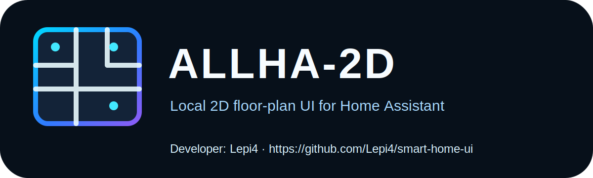

# ALLHA-3D — Home Assistant Add-on



**ALLHA-3D** — локальный 3D/floor-plan интерфейс управления Home Assistant с картой квартиры, комнатами, устройствами, датчиками, kiosk mode, SVG Layout Editor и безопасным хранением данных вне контейнера.

- **Developer:** Lepi4
- **GitHub:** https://github.com/Lepi4/smart-home-ui
- **Version:** v3.4.46
- **Copyright:** © Lepi4

Репозиторий остаётся прежним: `https://github.com/Lepi4/smart-home-ui`.

## Идея названия

`ALLHA-3D` шифрует личные инициалы/ФИО автора, **HA** как Home Assistant и **3D** как визуальный 3D/floor-plan подход к управлению домом.

## Возможности

- Home Assistant add-on через Ingress.
- Работа без ручного ввода HA URL и long-lived token.
- Supervisor API / `SUPERVISOR_TOKEN`.
- Overview-план квартиры и отдельные картинки комнат.
- Управление устройствами через HA services.
- Touch-first управление: тап, long press, kiosk-friendly UI.
- SVG Layout Editor вместо drag-and-drop.
- Координаты layout только в процентах `0–100`.
- Настройки и данные в `/data`, а не внутри Docker image.
- Backup layout.
- Entity diagnostics.
- Safe/dangerous service calls.
- Kiosk lock/autolock.
- Kiosk Attention Monitor.
- Debug mode для координат.

## Установка в Home Assistant

1. Открой Home Assistant:

```text
Settings → Add-ons → Add-on Store → ⋮ → Repositories
```

2. Добавь репозиторий:

```text
https://github.com/Lepi4/smart-home-ui
```

3. Установи add-on **ALLHA-3D**.
4. Запусти add-on и открой Web UI.

## GHCR images

GitHub Actions публикует образы:

```text
ghcr.io/lepi4/smart-home-ui-amd64:3.4.46
ghcr.io/lepi4/smart-home-ui-aarch64:3.4.46
```

## Структура данных

Пользовательские данные должны храниться в `/data`:

```text
/data/layout.json
/data/addon_config.json
/data/source_config.json
/data/ui_state.json
/data/devices.js
/data/devices.json
/data/lovelace-source.js
/data/lovelace_raw.json
/data/attention_rules.json
/data/images/
/data/backups/
```

Если при удалении add-on в Home Assistant выбрать **не удалять данные**, после повторной установки система должна восстановиться.

## SVG Layout Editor

Drag-and-drop удалён из режима редактирования.

Установка нового устройства:

```text
Редактировать → Устройства → выбрать устройство → SVG Layout Editor → клик/тап по сетке → X/Y или стрелки → Применить
```

Перемещение существующего устройства:

```text
Редактировать → выбрать маркер → долгое удержание → SVG Layout Editor → новая точка → Применить
```

## Kiosk Attention Monitor

В long press меню устройства есть блок **Внимание**. При включении правила текущее состояние сохраняется как нормальное. Если устройство уйдёт из этого состояния, в kiosk mode появляется компактная тревожная кнопка `!`.

Alert глобальный и не зависит от текущей комнаты.

## Lovelace source panel

Рекомендуется отдельная Lovelace-панель с карточками комнат:

```yaml
title: Smart Home UI Source
views:
  - title: Комнаты
    cards:
      - type: entities
        title: Кухня
        entities:
          - entity: light.kitchen_ceiling
            name: Люстра
          - entity: sensor.kitchen_temperature
            name: Температура
```

Приоритет комнаты:

```text
1. Lovelace card / section title
2. имя устройства / entity_id
3. Home Assistant Area
4. Неразмещённые
```

## About

**ALLHA-3D**  
Developer: **Lepi4**  
GitHub: https://github.com/Lepi4/smart-home-ui  
Copyright: © Lepi4
