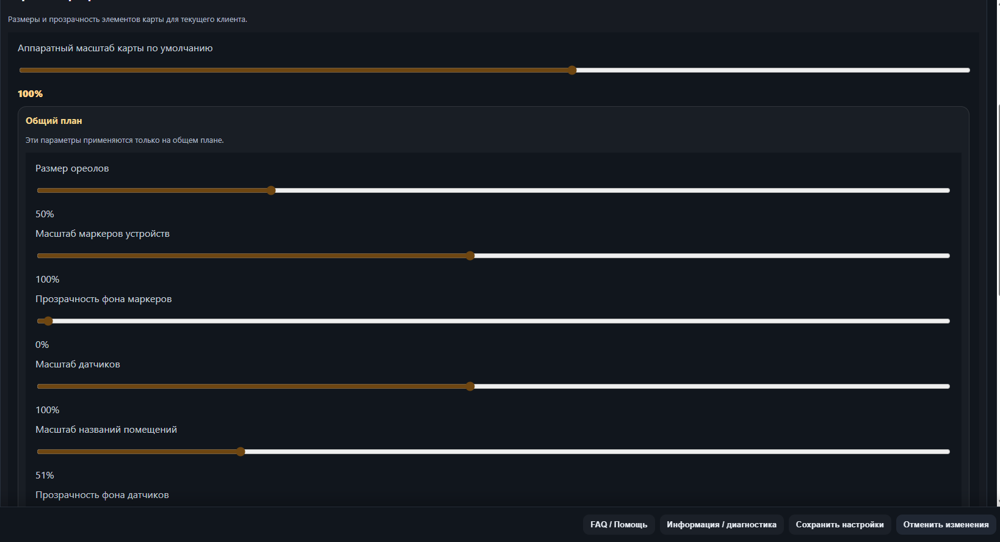
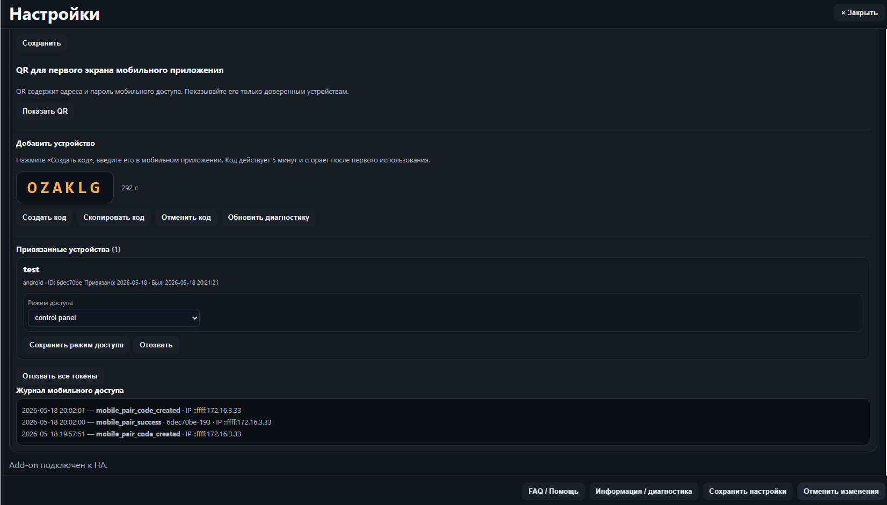
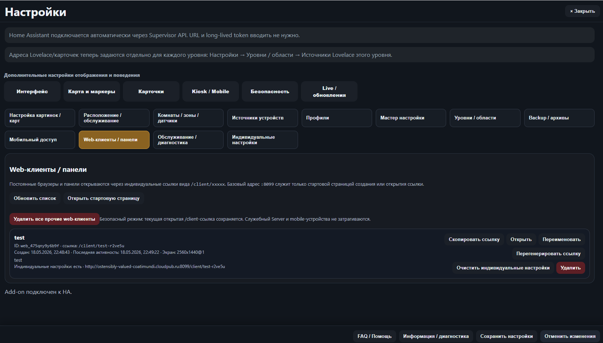
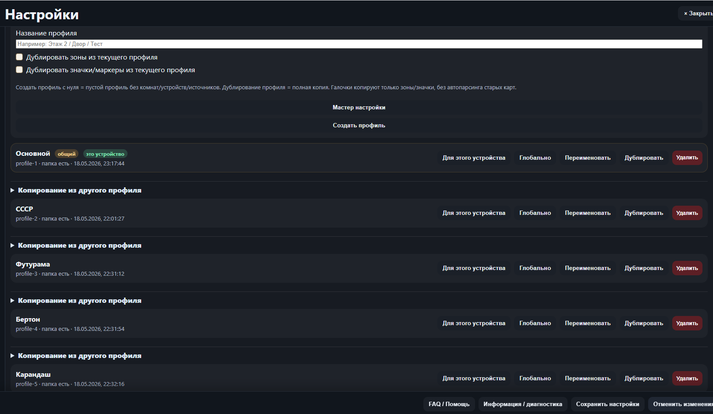
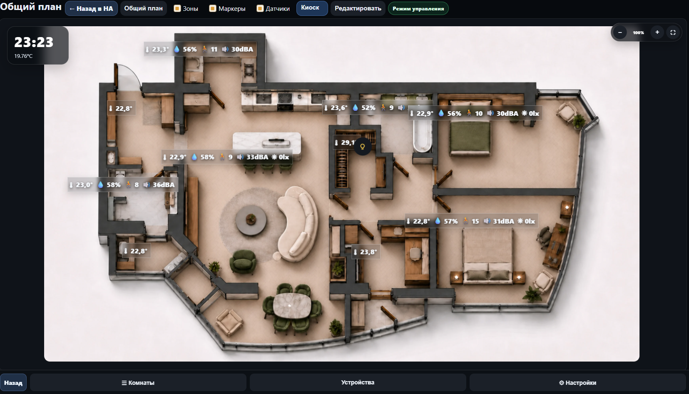
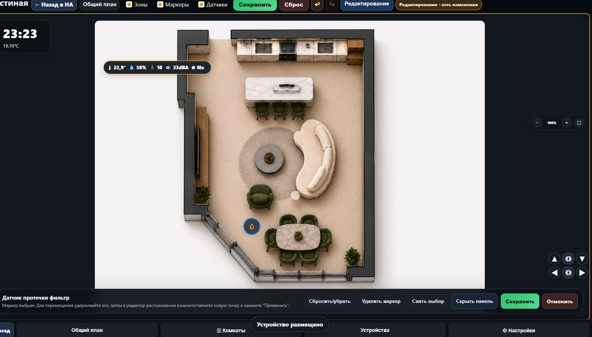
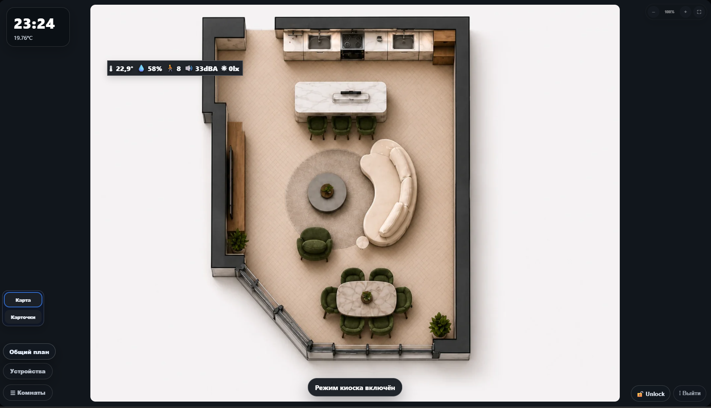
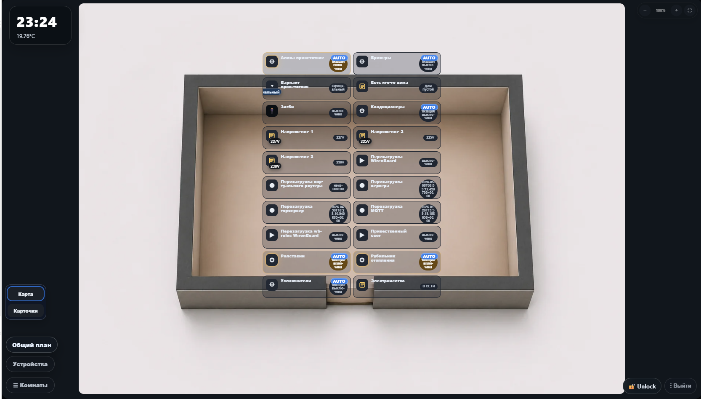

# ALLHA-2D — v5.1.0-beta.5

[🇬🇧 English version](README.md)

> **Интерфейс приложения в данный момент доступен только на русском языке.**

ALLHA-2D — 2D-дашборд для Home Assistant с планами помещений, комнатами, устройствами, стандартными датчиками комнат, виртуальными комнатами, режимами киоска/мобильного, веб-клиентами, backup-ами и поддержкой HA add-on / Ingress.

## Основные возможности

- Режим HA add-on через Ingress.
- Локальный Docker-режим для разработки/тестирования на Windows.
- Прямой мобильный API на порту `32457`.
- Веб-клиенты через постоянные ссылки `/client/<slug>`.
- Фиксированный контекст HA add-on / Ingress-клиента `Server`.
- Профили и уровни/зоны.
- Импорт источника Lovelace/устройств на уровень.
- Обзорный план и планы комнат.
- Маркеры устройств, зоны комнат, значки стандартных датчиков комнат.
- Виртуальные комнаты с автоматическими карточками устройств и скрытыми устройствами.
- Режимы: киоск, карточный, мобильный, а также индивидуальные настройки отображения на клиент.
- Режим внимания для мониторинга состояний и отклонений.
- Менеджер ручных backup-ов: создание, скачивание, загрузка, восстановление и удаление.

## Модель доступа

- `admin` — полный доступ ко всем функциям.
- `control` — управление устройствами и разрешённые настройки отображения/профиля на клиент.
- `viewer` — только чтение.

`Server` — это HA add-on / Ingress root-клиент. Он отдельный от `/client/<slug>` веб-клиентов и мобильных устройств.

## Как открыть

- `http://IP:8099/` — страница выбора/регистрации веб-клиента.
- `http://IP:8099/client/<slug>` — конкретный веб-клиент.
- Ingress root HA add-on открывает основной UI как клиент `Server`.
- `http://IP:32457/` — вход мобильного приложения / мобильный API.

## Установка как HA add-on

1. В Home Assistant: **Настройки → Дополнения → Магазин дополнений → ⋮ → Пользовательские репозитории**.
2. Добавить репозиторий: `https://github.com/Lepi4/smart-home-ui`
3. Найти **ALLHA-2D** в списке, установить и запустить.
4. Открыть через боковую панель HA или через Ingress.

## Локальный запуск через Docker (Windows)

```powershell
docker compose up -d
```

После запуска открыть `http://localhost:8099/`.

### Обновление

```powershell
docker compose down
docker compose build --no-cache
docker compose up -d
```

## Менеджер backup-ов

Раздел Backup поддерживает:

- создание ручного backup;
- скачивание backup;
- загрузку `.tar.gz/.tgz` backup, ранее скачанного из ALLHA-2D;
- восстановление полного backup с явным подтверждением;
- восстановление backup расположения маркеров/датчиков;
- удаление отдельного backup;
- очистку старых backup-ов;
- удаление всех backup-ов с подтверждением.

Восстановление и загрузка backup доступны только в режиме `admin`. Секреты, токены и PIN-подобные поля маскируются при создании backup.

## Стандартные датчики комнаты

Поддерживаемые типы:

- Температура
- Влажность
- Движение
- Шум
- CO₂
- Освещённость

Значки датчиков динамические — отображаются только настроенные типы. Долгое нажатие открывает окно датчика с типом, значением и entity ID. Ориентация значков настраивается отдельно для обзорного плана и комнаты.

## Виртуальные комнаты

Комнату можно пометить как виртуальную. В виртуальной комнате:

- устройства отображаются карточками вместо маркеров;
- переключение карта/карточки меняет только фоновый режим;
- скрытые устройства настраиваются в настройках комнаты;
- размер карточек, размер текста и прозрачность — индивидуальные настройки клиента.

## Индивидуальные настройки

Настройки применяются к текущему клиенту: мобильному устройству, веб-клиенту или `Server` UI. Они не меняют другие устройства. Настройки включают масштаб отображения, прозрачность, видимость, поведение киоска/мобильного, настройки карточек и навигацию клиента.

## Скриншоты









